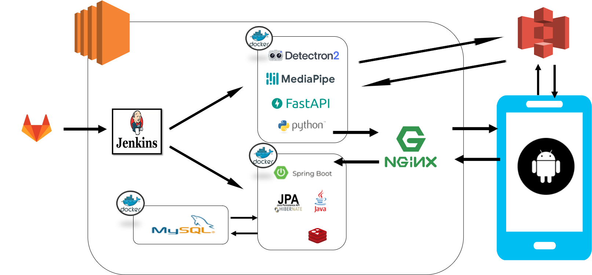
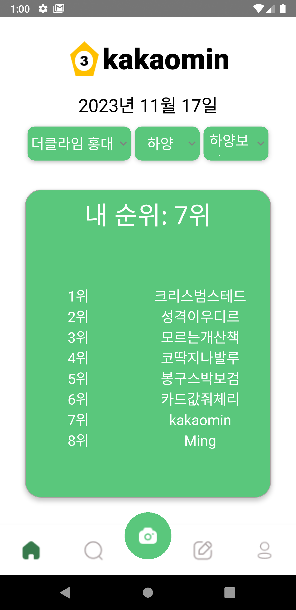
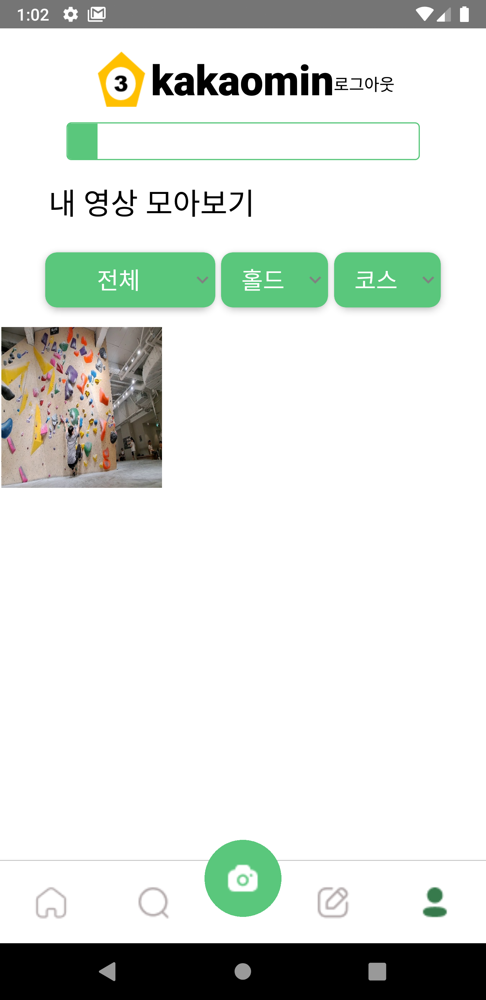
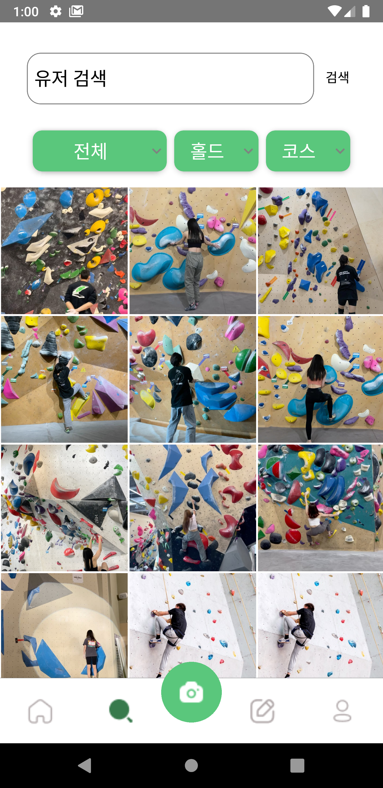
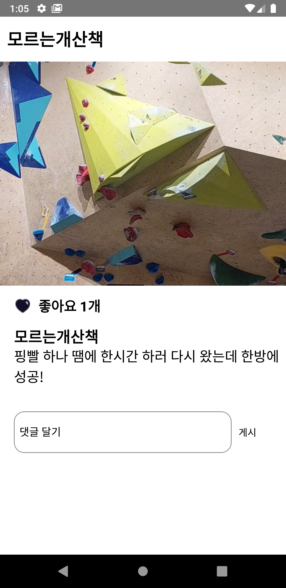

# 🍪drill 

## 1. 프로젝트 개요

 - 늘어나는 클라이밍 시장규모와 sns 업로드
 - 본인의 등반 영상을 업로드하고 다른 사람들의 영상을 모아 볼 수 있는 어플
 - 순위 시스템을 활용한 동기부여와 자체 등급 시스템을 활용한 객관적 실력 확인

## 2. 요구사항 정의서 (Usercase Diagram)

| 페이지구분       | 업무 대분류 | 업무 소분류            | 주요 기능         | 세부항목                                       |
| ----------- | ------ | ----------------- | ------------- | ------------------------------------------ |
| 로그인 페이지     | 유저 관리  | 로그인 기능            | 소셜 로그인        | 소셜 로그인 버튼을 클릭시 소셜 로그인 프로세스 진행              |
|             |        |                   | 로컬 로그인        | 로컬 로그인 버튼을 클릭시 로컬 로그인 프로세스 진행              |
| 닉네임 설정 페이지  |        | 닉네임 등록 기능         | 닉네임 등록        | 유저로부터 닉네임을 입력 받고 해당 닉네임 저장                 |
| 지점 설정 페이지   |        | 자주 방문하는 지점 등록 기능  | 지점 등록         | 더클라임 10개 지점 중 자주 방문하는 지점을 등록 받고 저장         |
| 랭킹 페이지 (메인) | 랭킹 관리  | 랭킹 조회 기능          | 랭킹 조회         | 유저가 설정한 지점의 새롭게 세팅된 코스별 랭킹 순위 리스트로 제공      |
|             |        |                   | 지점 선택         | 선택된 지점의 코스별 랭킹 순위 제공                       |
|             | 영상 관리  | 영상 등록 페이지로 이동 기능  | 영상 등록 페이지로 이동 | 영상 등록 버튼을 누르면 영상 등록 페이지로 이동                |
|             | 유저 관리  | 자주 방문하는 지점 수정 기능  | 지점 수정         | 유저가 설정한 지점으로 자주 방문하는 지점 수정                 |
|             |        | 유저 등급 조회 기능       | 유저 등급 조회      | 해당 유저가 해결한 코스 정보를 종합한 등급을 제공               |
| 영상 등록 페이지   |        | 영상 등록 기능          | 영상 등록         | 유저가 선택한 지점, 난이도, 홀드와 유저가 등록한 영상,텍스트로 영상 등록 |
|             |        | 영상 처리 기능          | 영상 처리         | 유저가 업로드한 내용을 기반으로 완등 여부 판단.                |
| 영상 상세 페이지   |        | 영상 상세 조회 기능       | 영상 상세 조회      | 해당 영상의 상세 정보 제공                            |
|             | 댓글 관리  | 댓글 기능             | 댓글 등록         | 유저들이 입력한 텍스트로 해당 영상에 댓글 등록                 |
|             |        |                   | 댓글 삭제         | 유저 본인이 등록한 댓글 삭제                           |
|             | 좋아요 관리 | 좋아요 기능            | 좋아요 등록        | 해당 영상 게시글의 좋아요 추가                          |
|             |        |                   | 좋아요 취소        | 해당 영상 게시글의 좋아요 취소                          |
|             | 신고 관리  | 신고 기능             | 신고 등록         | 해당 영상에 대한 신고 등록 (다른 코스, 시간 조작 등)           |
| 영상 목록 페이지   | 영상 관리  | 영상 조회 기능          | 영상 조회         | 유저들이 등록한 영상 썸네일로 제공                        |
|             |        |                   | 정렬 기준 선택      | 유저가 선택한 기준으로 영상 정렬                         |
|             |        |                   | 닉네임으로 검색      | 닉네임을 입력받아 해당 닉네임을 가진 유저의 영상을 조회            |
|             |        |                   | 지점으로 검색       | 유저가 선택한 지점의 영상 조회                          |
|             |        |                   | 코스별로 검색       | 유저가 선택한 지점의 코스에 해당하는 영상 조회                 |
| 마이 페이지      | 유저 관리  | 유저 등급 조회 기능       | 유저 등급 조회      | 해당 유저가 해결한 코스 정보를 종합한 등급을 제공               |
|             | 영상 관리  | 해당 유저의 영상 조회 기능   | 유저 영상 조회      | 해당 유저가 등록한 영상 목록 제공                        |
|             |        | 유저가 좋아요한 영상 조회 기능 | 좋아요 영상 조회     | 해당 유저가 좋아요한 영상 목록 제공                       |

## 3. 테이블 구조도 (ERD)
   
   

## 4. 아키텍처
   
   

## 5. 상세 페이지(시연)

### 👪참여자
😺 SSAFY 9기 정태희(팀장)
😎 SSAFY 9기 구민석(팀원)
🐻 SSAFY 9기 이상우(팀원)
🐮 SSAFY 9기 박대균(팀원)
🤖 SSAFY 9기 유진욱(팀원)
🐼 SSAFY 9기 이경호(팀원)
